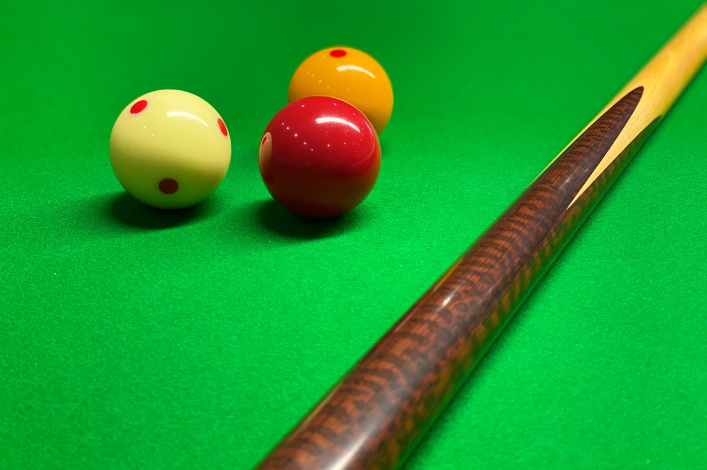

:doctype: book
:sectnums:
:chapter-label:
:toc: left
:toc-title: Tartalomjegyzék
:toclevels: 3
:stylesheet: stylesheets/snooker.css

= AZ ANGOL BILIÁRD SZABÁLYAI

----
A magyar nyelvű fordítást készítette: Kószó Éva
Lektorálta: Bekk László

A magyar nyelvű fordítás alapjául szolgáló eredeti szabályzat:
Official rules of the games of Snooker and English Billiards

A fordítás a magyar játékosok és nézők számára készült segédanyag, azt a WPBSA nem lektorálta.
----

== FEJEZET: A FELSZERELÉS
A zárójelben megadott méretek a brit birodalmi mértékegységrendszer szerint megadott értékek metrikusra váltott legjobb közelítő értékei, milliméterben. +

=== A szabványos asztal
[loweralpha]
. A játéktér +
Játéktérnek a falak belső felülete közti tér tekintendő, amelynek mérete 11 ft 8½ in × 5 ft 10 in (3569 mm × 1778 mm), mindkét irányban +/-  ½ in (13 mm) hibahatárral.
. Magasság +
Az asztal magassága a padlószinttől a falak felső felszínéig 2 ft 10 in (864 mm), +/-  ½ in (13 mm) hibahatárral.
. A felső és az alsó fal +
A játéktér két rövidebb falát nevezzük alsó (vagy Baulk) és felső falnak. Amikor a posztót az asztalra feszítik, a száliránynak az alsó faltól a felső fal felé kell futnia.
. Baulk-line, Baulk +
Az alsó fallal párhuzamos, tőle 29 in (737 mm) távolságban húzott egyenes vonalat Baulk-line-nak nevezzük. A Baulk-line és az alsó fal által határolt rész a Baulk.
. A “D” +
A “D” egy félkör, amelynek origója a Baulk-line felezőpontja, és a sugara 11½ in (292 mm).
. [[Pontok]] Pontok +
Az asztal hosszanti középvonala négy pontot jelöl ki:
[lowerroman]
.. a középvonalon a Felső fal felezőjétől 12¾ in (324 mm) távolságra eső pont A Pont.
.. a középvonal felezőpontja a Középső pont;
.. a Középső pont és A Pont közti szakasz felezőpontja a Piramis pont;
.. a Baulk-line felezőpontja a Felezőpont;

. A zsebek +
A zsebek a játéktér négy sarkán, és a hosszú oldalak felezéspontján helyezkednek el.

=== Golyók
[loweralpha]
. A golyókészlet egy Piros, egy Fehér és egy Sárga golyóból (amelyen pöttyök lehetnek) áll. Alternatívaként használható egy Piros, egy fehér, és egy pöttyös Fehér golyó is (ez utóbbin a felismerhetőség végett legalább két pöttynek kell lenni).
. A golyók anyagösszetétele meghatározott, átmérőjük 52,5 mm, +/- 0,05 mm hibahatárral.
. Lehetőség szerint az összes golyó súlyának egyeznie kell, de a súlykülönbség a legkönnyebb és legnehezebb golyó között nem haladhatja meg a 0,5 g-ot.
. A játékosok közti megegyezés vagy a játékvezető döntése alapján lehetőség van egyes golyók, vagy az egész golyókészlet lecserélésére.

=== Dákó
A dákó nem lehet rövidebb mint 3 ft (914 mm), kialakítását tekintve pedig nem térhet el a hagyományos, elvékonyodó formától, amelynek a vékonyabb vége a lökésekhez használt dákóbőrrel van felszerelve.

=== Kiegészítők
A játékosok számos féle dákótámaszt, hosszú dákót, hosszabbítókat, és toldatokat használhatnak. Ezek egy része olyan kiegészítő, ami hagyományosan az asztal tartozéka, de lehet a játékos vagy a játékvezető által biztosított eszköz is. Minden toldat, hosszabbító, és egyéb a célzást vagy a lökést segítő kiegészítőt a használatot megelőzően az illetékes szervekkel engedélyeztetni kell.

== FEJEZET: DEFINÍCIÓK
A jelen fejezetben definiált fogalmakat a szabálykönyvben dőlt betűvel jelöltük. +

=== Játszma [[Játék, Játék]]
Az angol biliárdban  egy _játszma_ a kezdéstől (lásd: <<Kezdes>>) indul; a játékosok vagy csapatok felváltva állnak az asztalhoz, amíg az alábbiak szerint a _játszma_ véget nem ér:
[loweralpha]
. ha bármelyik játékos feladja a küzdelmet;
. ha az előre meghatározott időkeret letelik;
. ha az egyik fél vagy csapat eléri az előre meghatározott pontszámot;
. ha a játékvezető a _játékot_ az egyik játékosnak ítéli az alábbi szabályok alapján: <<Unfairplay>>, <<Sabotage>>, <<Idohuzas>>. +

=== Meccs
A _meccs_ egyeztetett vagy meghatározott számú _játszmából_ áll.
A _meccs_ az alábbi szabályok értelmében odaítélhető: <<Minosithetetlen-viselkedes>>, <<Sabotage>>, <<Ismetelt-idohuzas>>.

=== Golyók
[loweralpha]
. A Fehér és a Sárga (vagy Sárga helyett Pöttyös Fehér) golyót kiosztják a két játékosnak vagy csapatnak. A _támadójátékosé_ a célzógolyó (cue-ball); a másik golyó a nem-_támadójátékosé_.
. A nem-_támadójátékos_ golyója és a Piros golyó a _célgolyók_.

=== Mandiner
A mandinergumi _egyenes frontja_ a játéktér oldalai mentén fut végig. Az _ívelt frontot_ attól a ponttól kell számítani, ahonnan a mandinergumit ívbe vágják a zsebnyílások kialakításakor.

=== Tempólökés
A _tempólökés_ (string) során a játékosok az asztal két felén, a _baulk vonalról_ egyszerre ellöknek egy-egy _célzógolyót_ a felső fal felé úgy, hogy az az alsó fal irányába visszapattanjon.
A _tempólökést_ az a játékos nyeri, akinek a _célzógolyója_ a játékvezető megítélése szerint közelebb áll meg az alsó falhoz.
A _tempólökés_ során a _célzógolyók_ csak a felső és az alsó fal _egyenes frontját_ érinthetik.
A _tempólökést_ elveszíti az a játékos:
[loweralpha]
. aki a felső és alsó falon kívül bármely másik falat eltalálja;
. akinek a _célzógolyója_ átmegy az ellenfél térfelére.

=== Támadójátékos, vizit
A _lökésre_ következő, vagy épp játékban lévő játékos a _támadójátékos_. A _vizitje_ addig tart, amíg:
[loweralpha]
. egy _lökés_ során nem sikerül pontot szereznie;
. _hibát_ vét; majd ezt követően az összes golyó megáll, és a játékvezető megállapítja, hogy a játékos már nincs az asztalnál;

=== Lökés
[loweralpha]
. _Lökésnek_ azt nevezzük, amikor a _támadójátékos_ a dákóbőrrel meglöki a golyót, kivéve, ha ez még vizírozás közben történik (feathering).
. A _célzógolyót_ a mozdulat közben csak egyszer lehet meglökni, előre tolni nem lehet.
A dákóbőr csak egy pillanatra maradhat érintkezésben a _célzógolyóval_, miután az megmozdult.
. A _lökés_ akkor szabályos, ha annak során egyetlen szabályt sem sértettek meg;
. A _lökés_ mindaddig nem tekinthető befejezettnek, amíg:
[lowerroman]
.. minden golyó meg nem állt;
.. minden visszahelyezendő golyó vissza nem került a helyére,
.. a _támadójátékos_ által használt minden segédeszközt el nem távolítottak, vagy a játékvezető megítélése szerint a _lökés_ véget nem ért.
. A _lökés_ lehet közvetlen vagy közvetett, vagyis:
[lowerroman]
.. ha a _célzógolyó_ úgy találja el a _célgolyót_, hogy előbb nem ér falat, a _lökés_ közvetlen;
.. ha a _célzógolyó_ úgy találja el a _célgolyót_, hogy előbb egy vagy több falat ér, a _lökés_ közvetett; +

=== Belökés
_Belökésnek_ (potting) azt nevezzük, ha egy _célgolyó_ úgy kerül a zsebbe valamely más golyóval való találkozás után, hogy eközben egyetlen _szabálytalanság_ sem történt. +

=== In-off
_In-offnak_ nevezzük azt, amikor a _célzógolyó_, miután valamelyik _célgolyóval_ találkozott, beesik egy zsebbe anélkül, hogy eközben szabálytalanság történne.
Ha a _célzógolyó_ mindkét _célgolyót_ eltalálja, akkor az elsőként eltalált _célgolyó_ számít.

=== Hazard
_Hazardnak_ azt a fajta pontot érő _lökést_ nevezzük, amikor _lökés_ közben nem történik _cannon_.
_Hazard_ lehet:
[loweralpha]
. _belökés_, amit győztes _hazardnak_ is hívnak;
. _in-off_, amit vesztes _hazardnak_ is hívnak;
. két _belökés_;
. egy _belökés_ és egy _in-off_;
. két _belökés_ és egy _in-off_.

=== Cannon
_Cannonnak_ azt nevezzük, mikor a _célzógolyó_ mindkét _célgolyót_ érinti egy _lökés_ során, és eközben nem történik szabálytalanság.
Egy lökésnél csak egy _cannon_ ér pontot.

=== Break
A _break_ egymást követően végrehajtott _lökések_ sorozata, amelyet egy _vizit_ alkalmával visz véghez a _támadójátékos_.

=== Játék kézből
[loweralpha]
. A _célzógolyó_ kézben van a következő esetekben:
[lowerroman]
.. minden _játszma_ kezdete előtt;
.. ha _belökték_;
.. ha elhagyta a játékteret;
.. ha a következő szabályok értelmében visszahelyezik: <<touchingball>>, <<foul-utan>>.
. A _célzógolyó_ mindaddig kézben van, amíg:
[lowerroman]
.. a _kézből_ történő _lökés_ szabályosan le nem zajlik,
.. a játékos hibát követ el, amíg a _célzógolyó_ a játéktéren van;
.. ha a következő szabályok valamelyike értelmében visszahelyezik: <<tizenot-hazard>>, <<foul-utan>>.
. A játékos kézből jön, amíg a fentiek szerint a _célzógolyó_ kézben van.

=== Játékban lévő golyó
[loweralpha]
. A játékos _célzógolyója_ mindig _játékban van_, amikor nincs kézben.
. A Piros golyó _játékban van_ az asztalra helyezéstől addig, amíg be nem lökik, vagy amíg el nem hagyja a játékteret.

=== Golyó a Baulk sávban
Egy golyó akkor van a _Baulk sávban_, ha a közepével a Baulk vonalon, vagy a Baulk vonal és az alsó fal között áll meg.

=== Miss [[miss, Miss]]
_Missnek_ azt nevezzük, amikor a _kézből_ szabályosan ellökött _célzógolyó_ egyetlen _célgolyót_ sem talál el, miközben egyetlen _célgolyó_ sincs a _Baulk sávon_ kívül.
A _miss_ nem számít _hibának_.

=== Coup
_Coupnak_ azt nevezzük, ha a _kézből jövő_ játékos a _célzógolyót_ közvetlenül a zsebbe, vagy közvetlenül az _ívelt frontról_ a zsebbe löki, miközben egyetlen golyó sincs a _Baulk sávon_ kívül.
Nem számít _coupnak_, ha a _célzógolyó_ az egyik _egyenes frontról_, közvetve kerül egy zsebbe, vagy ha az egyik zseb _ívelt frontjáról_ egy másik zsebbe esik be.

=== Szabálytalanság, hiba
_Szabálytalanságnak_ minősül a szabálykönyvben foglaltak megsértése.
A _támadójátékos_ által elkövetett minden _szabálytalanságot_ _hibának_ (foul) nevezzük.

=== A játéktér elhagyása és szabálytalan belökés
Ha egy golyó a játéktéren kívül, de nem valamelyik zsebben áll meg egy lökést követően, úgy kell tekinteni, hogy elhagyta a játékteret.
A játéktér elhagyásának minősül az is, ha a _támadójátékos_ egy _játékban lévő_ golyót felemel.
_Szabálytalan belökésnek_ számít, ha egy golyó úgy kerül a zsebbe, hogy pontszerzés nem történt.

=== Foglalt pont
Egy pont akkor tekintendő foglaltnak, ha a golyót nem lehet rá visszahelyezni anélkül, hogy egy másik golyóhoz hozzáérne.

=== Tolás
_Tolásnak_ minősül, ha a dákóbőr a _lökés_ során érintkezésben marad a _célzógolyóval_:
[loweralpha]
. miután a _célzógolyó_ előremozdult -- a dákóbőr csak egy pillanatra, az első érintésnél maradhat érintkezésben a _célzógolyóval_;
. amikor a _célzógolyó_ hozzáér egy célgolyóhoz, kivéve amikor a _célzógolyó_ és a _célgolyó_ csak majdnem tapad -- ilyenkor egy kellően “vékony” találat nem számít _tolásnak_.

=== Ugratás
Ugratásnak azt nevezzük, mikor a _célzógolyó_ áthalad egy _célgolyó_ bármelyik része felett, függetlenül attól, hogy eközben érinti azt vagy nem.
Kivételek:
[loweralpha]
. ha a _célzógolyó_ először egy _célgolyót_ talál el, és az ugratás csak ezután történik;
. ha a _célzógolyó_ ugratás közben eltalál egy _célgolyót_, de nem annak túloldalán érkezik vissza a játéktérre;
. ha a _célzógolyó_ szabályosan eltalál egy _célgolyót_, majd egy másik golyóval vagy a fallal történt találkozás után átugorja az elsőként talált _célgolyót_.

== FEJEZET: A JÁTÉK

=== Leírás

Az angol biliárdot játszhatja két játékos, vagy kettőnél több játékos csapatokban. Az alábbi pontok részletezik a játék menetét.

[loweralpha]
. A játékot a következő három golyóval játsszák: egy sima Fehér, ami az egyik játékosé vagy csapaté; egy Sárga (vagy Pöttyös Fehér), ami a másik játékos vagy csapaté; valamint egy Piros golyó.
. A _támadójátékos_ egy _vizit_ során _belökésekkel_, _in-offokkal_, és _cannonokkal_ gyűjt pontokat, önállóan vagy ezek kombinációjával.
. A pontot érő lökések pontértéke a _támadójátékos_ pontjaihoz adódik.
. A _hibák_ és _missek_ után járó hibapontok a vétlen játékos pontjaihoz adódnak.
. A _játszma_ során általános taktika, hogy mindkét _célgolyót_ a _Baulk sávban_ hagyják, mikor a következő játékos _kézből fog jönni_, így azok eltalálása csak közvetett módon lehetséges.
. A _játszma_ nyertese az a játékos vagy csapat,
[lowerroman]
.. aki a megállapodás vagy kiírás szerinti idő alatt több pontot gyűjt;
.. aki előbb eléri a megállapodás vagy kiírás szerinti pontszámot;
.. akinek a javára a ítélik a _játszmát_ az alábbi szabályok valamelyike értelmében: <<Unfairplay>>, <<Sabotage>>, <<Idohuzas>>
.. akinek a javára a _játszmát_ feladták.
. A _meccs_ nyertese az a játékos vagy csapat, aki több _játszmát_ nyert, vagy aki összességében több pontot szerzett, amennyiben ezt veszik alapul; vagy
akinek a javára ítélték a meccset az alábbi szabályok egyike értelmében: <<Minosithetetlen-viselkedes>>, <<Sabotage>>, <<Ismetelt-idohuzas>>.

=== A játék kezdete

A Fehér és Sárga (vagy Pöttyös Fehér) golyó kiosztását, és a kezdő játékost tempólökéssel, vagy egyéb közösen választott módon kell eldönteni.
A tempólökés nyertese dönt mindkét kérdésben, hacsak nem egyeznek meg ezekről.
[loweralpha]
. Ha a játékosok sorrendje eldőlt a fentiek szerint, az a _játékon_ belül végig változatlan marad.
. [[Kezdes, Kezdés]] A Piros golyót A Pontra helyezik, és a kezdő játékos _kézből jön_. A _játszma_ akkor kezdődik el, mikor az elsőként _támadó játékos_ az asztalra helyezi a _célzógolyót_, és azt a dákóbőrrel megérinti:
[lowerroman]
.. szabályos lökéssel;
.. vagy a lökésre készülve, kivéve <<hoppa>>.
. A játékos felelőssége, hogy a saját _célzógolyóját_ használja, még akkor is, ha a játékvezető rossz golyót ad neki.
. Ha egy több _játszmából_ álló _meccsen_ az egyik _játszmát_ nem a megfelelő játékos kezdte:
[lowerroman]
.. amennyiben csak egy _lökés_ volt, és hiba nem történt, a _játszmát_ újrakezdik anélkül, hogy bármelyik játékos büntetést kapna;
.. amennyiben legalább két _lökés_ volt, vagy bármilyen _szabálytalanság_ történt a kezdőlökés során vagy azt követően, a _játszma_ nem kezdődik újra.
Az ezt követő _játszmák_ a helyes kezdési sorrendben folytatódnak, vagyis a soron kívül kezdő játékos három egymást követő _játszmát_ fog kezdeni;

=== A játék menete

. A játékosok felváltva löknek; ha a _támadójátékos_ pontot szerez, úgy folytathatja a _breaket_ az adott állásból, vagy kézből _in-off_ vagy <<touchingball>> esetén.
. Ha a _támadójátékos_ nem szerez pontot, akkor a _vizitje_ véget ér, és a soron másik játékos következik az adott állásból;
ha a játékos _célzógolyója_ nincs az asztalon, vagy hozzáér egy másik golyóhoz, akkor a játékos kézből jön a <<touchingball>> szabály szerint.
. Hibát követően a vétlen játékos ezen felül választhatja azt is, hogy kézből jön, és mindkét _célgolyót_ visszateszik a helyére a <<foul-utan>> szerint.
. Ha egy vizit utolsó lökése vagy egy hiba után a soron következő játékos meglöki a _célzógolyót_ vagy hibát követ el, mielőtt az összes golyó megállna, vagy mielőtt a játékvezető befejezte volna a golyók visszahelyezését, a játékos vizitje véget ér, és _támadójátékosnak_ kell kezelni a hibapontok megállapításánál.

=== Pontszerzés

A pontokat az alábbi szabályok alapján kell megállapítani:
[loweralpha]
. A _cannon_, a _belökött_ Fehér, a _belökött_ Sárga, az _in-off_ Fehér, és az _in-off_ Sárga mind két-két pontot ér.
. a _belökött_ Piros és az _in-off_ Piros három ponot ér.
. Ha egy vagy több _hazard_, vagy egy _cannon_ és _hazardok_ kombinációja történik egy lökés során, úgy mindegyik után pont jár.
. Amikor egy lökés során _in-off_ és _cannon_ is történik, akkor az _in-offot_ is számítani kell (a _cannonon_ felül):
[lowerroman]
.. három pontot ér, ha a _célzógolyó_ a Pirosat találja el elsőnek;
.. kettő pontot ér, ha a _célzógolyó_ az ellenfél _célzógolyóját_ találja el elsőnek;
.. kettő pontot ér, ha a _célzógolyó_ a két _célgolyót_ egyszerre találja el;

=== A szakasz vagy a játszma vége [[vege, A szakasz vagy a játszma vége]]
[loweralpha]
. Ha a szakaszra meghatározott időkeret lejár, a játékvezető bejelenti, hogy az idő lejárt.
Ha egy _lökést_ még ez előtt megkezdtek, akkor az még érvényes, és az ezzel szerzett pontok számítanak.
Ha a véget ért szakaszt újabb szakasz követi, a játékvezető megméri és lejegyzi a golyók helyzetét, hogy a játékot ugyanebből az állásból folytassák
. Ha az utolsó szakasz ér véget a fentiek szerint, akkor az az időre menő _meccs_ végét jelenti;
. Az időre menő _játszma_ vagy _meccs_ során az idő lejártakor lehet pontegyenlőség; ennek feloldásáról az időkeretet meghatározó szabálynak kell rendelkeznie.
. A meghatározott vagy kiírás szerinti pontszám elérésével végződő meccset az a játékos nyeri, aki elsőként éri el vagy lépi túl a ponthatárt.
Ilyenkor a végeredménybe csak a ponthatár eléréséhez szükséges pontok számítanak bele, azonban a játékos _breakjébe_ minden szerzett pont beleszámít.

=== Játék kézből

Kézből történő játék során a Fehér golyót a "D" vonalára vagy azon belülre kell helyezni, és onnan ellökni.
[loweralpha]
. A _támadójátékos_ kérésére a játékvezetőnek ki kell jelentenie, hogy a _célzógolyó_ szabályosan lett-e elhelyezve (tehát nincs a "D" vonalán kívül);
. [[hoppa, Pozícionálás közben]]Ha a _célzógolyó_ a "D" vonalán kívül, pozícionálás közben érintkezik a dákóbőrrel, és a játékvezető ítélete szerint ez nem vizírozás vagy lökési kísérlet volt, úgy a _célzógolyó_ nincs játékban.
. A _célzógolyónak_ a lökés során el kell hagynia a _Baulk sávot_.
A _Baulk sáv_ elhagyásának számít az is, ha a _célzógolyó_ fizikailag ugyan nem hagyja el a _Baulk sávot_ de ütközik olyan golyóval, ami a _Baulk sávon_ kívül van.
. A _célzógolyónak_, mielőtt megállna a _Baulk sávban_ vagy eltalálna egy ott lévő golyót, előbb falat kell érnie vagy el kell találnia egy _célgolyót_ a _Baulk sávon_ kívül.
. A _célzógolyót_ a _baulk sáv_ mandinerére is lehet lökni, és így indirekt módon eltalálni egy, a _baulk sávon_ kívül lévő golyót.
. Ha egy _célgolyó_ a _Baulk sávban_ van, akkor semmilyen részét nem szabad _direkt_ módon eltalálni akkor sem, ha ez a része fizikailag a _Baulk sávon_ kívülre esik.

=== Golyó a Baulk vonalon

A játékos kérésére a játékvezetőnek ki kell jelentenie, hogy egy, a Baulk vonalon vagy annak közelében álló golyó a _Baulk sávban_ van-e.

=== A Baulk vonal keresztezése

Minden esetben, amikor a _Baulk vonal kersztezése_ szabály alkalmazandó, a _célzógolyónak_ egy szabályos lökés során át kell haladnia a Baulk vonalon, minden _breakben_ összegyűjtött 100 pontonként 80 és 100 pont között.
[loweralpha]
. A Baulk line keresztezése a _baulk sáv irányába_ vagyis a posztó szálirányával ellentétesen kell, hogy történjen.
. Ha a _célzógolyó_ akkor van a _baulk sávban_, mikor áthalad a Baulk vonalon (ha a golyó a közepével a Baulk vonalon áll meg, akkor nem haladt át a vonalon)
. Azután a lökés után, amivel egy játékos elérte vagy átlépte a 80 pontot egy _Beakben_, a játékvezetőnek be kell mondania, hogy "Baulk line figyelmeztetés 80 pontnál".
. A Baulk vonalat keresztező lökést a 20 pontos tartományban, vagyis 80 és 100 pont között kell elvégezni, a 100 pontot elérő vagy meghaladó lökéssel vagy még az előtt.
. Ha a játékvezető elmulasztja bejelenteni a figyelmeztetést a megfelelő pontszámnál, és ezt később pótolja, akkor a figyelmeztetés elhangzásától számított 20 pontos tartományban kell a baulk vonalat keresztező lökést elvégezni.
Ez nem befolyásolja a következő break-et és az abban esetékes figyelmeztetést.
. Ha a játékvezető úgy ítéli meg, hogy egy lökésnél a _célzógolyó_ szabályosan áthaladt a baulk vonalon, akkor ezt bejelenti.
. Ha a _támadójátékos_ a baulk vonalat keresztező lökést kézből vagy a _Baulk sávból_ is elvégezheti; ilyenkor a _célzógolyónak_ (a játékvezető megítélése szerint) vagy teljesen, vagy nagyobb részben át kell haladnia a baulk vonalon, mielőtt visszafelé újra keresztezné azt.
. Ha a _támadójátékos_ _breakje_ nem ér véget egy nem-pontszerző lökéssel, de elmulasztja a baulk vonalat keresztező lökést 80 és 100 pont között a fentiek szerint, az _hibának_ számít, és a vétlen játékos a _hiba_ utáni szokásos lehetőségek közül választhat.

=== A célgolyók visszahelyezése
[loweralpha]
. Ha a Piros golyót szabályosan vagy szabálytalanul _belökik_, vagy eltávolítják az asztalról, úgy a golyót a következő _lökés_ előtt A Pontra vissza kell helyezni, vagy:
[lowerroman]
.. ha A Pont foglalt, úgy a Piros golyót a Piramis pontra kell helyezni.
.. ha A Pont és a Piramis pont is foglalt, úgy a Piros golyót a Középső pontra kell helyezni.
. Ha a Piros golyót egy breaken belül egymás után kettő (vagy hibásan több) alkalommal belökték, és ezeknél a lökéseknél egyéb pontszerzés nem történt, úgy a Piros golyót a Középső pontra kell visszahelyezni, kivéve:
[lowerroman]
.. ha a Középső pont foglalt, ilyenkor a Piros golyó a Piramis pontra kerül vissza;
.. ha a Középső pont és a Piramis pont is foglalt, ilyenkor a Piros golyó A Pontra kerül vissza, de nem számíthat bele egy, A Pontról történő belökések sorozatába.
. A Piros golyó többször egymás utáni belökése esetén, ha más pontszerzés nem történt, akkor sorozatban egymás után a Piros golyót kétszer lehet A Pontra visszahelyezni, ezt követően pedig egyszer a Középső pontra, ha ezek a pontok nem foglaltak.
. A _támadójátékos_ kérésére a játékvezetőnek tájékoztatni kell a játékost arról, hogy az adott pontról hány egymást követő belökés történt.
. Az ellenfél _célzógolyóját_ az alábbi szabályok alapján kell visszahelyezni: <<tizenot-hazard>>, <<touchingball>>, <<foul-utan>>.
. Egy golyó akkor került vissza megfelelően a helyére, ha a fenti szabályok szerint helyezték vissza.
. Ha egy szabályosan visszahelyezett golyóhoz egy másik golyó hozzáér, akkor az többet nem tekinthető a ponton álló golyónak még akkor sem, ha fizikailag nem mozdult el onnan.
. A játékos nem büntethető azért, ha a játékvezető hibázik a golyók visszahelyezésekor.

=== A cannonok számának korlátozása

Egymás után, nem _hazardokkal_ kombinálva, sorozatban összesen legfeljebb hetvenöt _cannon_ lökhető.
[loweralpha]
. Hetven _cannon_ után a játékvezetőnek be kell jelentenie a HETVEN CANNON figyelmeztetést.
Ha a játékvezető elmulasztja időben megtenni a figyelmeztetést, és ezt csak később pótolja, úgy a _támadójátékos_ a figyelmeztetéstől számított további öt _cannont_ lökhet.
. A _támadójátékos_ kérésére a játékvezetőnek tájékoztatni kell a játékost arról, hogy hány egymást követő _cannon_ történt.

=== A hazardok számának korlátozása

Egymás után, nem _cannonokal_ kombinálva, sorozatban összesen legfeljebb tizenöt _hazard_ lökhető.
[loweralpha]
. Tíz _hazard_ után a játékvezetőnek be kell jelentenie a TÍZ HAZARD figyelmeztetést.
Ha a játékvezető elmulasztja időben megtenni a figyelmeztetést, és ezt csak később pótolja, úgy a _támadójátékos_ a figyelmeztetéstől számított további öt _hazardot_ lökhet.
. A _támadójátékos_ kérésére a játékvezetőnek tájékoztatni kell a játékost arról, hogy hány egymást követő _hazard_ történt.
. [[tizenot-hazard, Tizenöt hazard után]]Ha a nem-_támadójátékos_ a saját vizitjének utolsó lökésével belökte a saját _célzógolyóját_, akkor az a tizenötödik _hazard_ után kerül vissza a játéktérre, a Felezőpontra, vagy amennyiben az foglalt, úgy a Baulk felől nézve a "D"  jobbkéz felőli sarkára.

=== Golyó a zseb szélén [[Zseb-szelen, Golyó a zseb szélén]]

Ha egy golyó úgy esik a zsebbe, hogy más golyó nem ért hozzá, akkor:
[loweralpha]
. ha a golyó nem volt érintett az aktuális lökésben, úgy az visszakerül a helyére; a lökésben szerzett pontok számítanak;
. ha a golyó a lökésben érintett lehetett volna, úgy akkor:
[lowerroman]
.. ha nem történt _szabálytalanság_ vagy hiba (beleértve egy esetleges olyan hibát is, amiben a leeső golyó szerepelhetett volna), úgy a _lökés_ előtti állapotot vissza kell állítani és a lökést megismételni; a _támadójátékos_ ugyanakkor választhat másik lökést is;
.. ha hiba történt, úgy minden golyót vissza kell helyezni a _lökés_ előtti állapotba, és a hiba után érvényes szabályok szerint folytatni a játékot.
. Ha egy golyó a zseb szájában egy pillanatra megáll, de ezt követően beesik, akkor az a helyzettől függően szabályos vagy szabálytalan _belökésnek_, esetleg _in-offnak_ számít, és nem kell visszahelyezni. +

=== A golyók elmozdulása a lökéstől függetlenül [[Magic, A golyók elmozdulása a lökéstől függetlenül]]

Ha egy álló vagy mozgó golyó a _támadójátékostól_ függetlenül megmozdul, a játékvezetőnek vissza kell állítania azt az eredeti pozíciójába, vagy abba a pozícióba, ahol feltételezhetően megállt volna. Ilyenkor a _támadójátékost_ nem büntetik. +
[loweralpha]
. Ez a szabály érvényes abban az esetben, ha a _támadójátékos_ egy rajta kívül álló esemény vagy egy másik személy (aki nem a csapattársa) miatt mozdít meg egy golyót, nem alkalmazható azonban akkor, ha a golyó az asztalfelület hibája miatt mozdul meg, kivéve, ha egy visszaállított golyó mozdul meg még a következő _lökés_ előtt.
. A játékvezető által megmozdított golyók miatt egyik játékos sem büntethető.

=== Touching ball [[touchingball, Touching ball]]
[loweralpha]
. Ha egy lökést követően a _támadójátékos_ _célzógolyója_ úgy állapodik meg, hogy hozzáér egy másik golyóhoz, a játékvezető touching ballt ítél, és mindkét játékosnak vagy félnek lehetőséget biztosít, hogy röviden megvizsgálják az állást.
Ezt követően a Piros golyót A Pontra, a nem-_támadójátékos_ _célzógolyóját_ pedig, amennyiben az az asztalon van, a Középső pontra állítja, és a  _támadójátékos_ kézből jöhet.
Amennyiben egy Piros belökése után a Fehér úgy állapodik meg, hogy egy vagy több színeshez hozzáér, úgy a játékvezetőnek meg kell kérnie a támadójátékost, hogy egyértelműen nevezze meg a célgolyóként választott színest.
. Ha egy álló _célgolyó_ nem érintkezett a hozzá közel lévő _célzógolyóval_ mikor a játékvezető megvizsgálta az állást, később azonban mégis hozzáér, úgy ha még nem történt _lökés_, a golyókat visszaállítja a korábbi, nem érintkező helyzetbe.
. A _támadójátékos_ kérésére a játékvezetőnek egyértelműen meg kell válaszolnia, hogy a _célgolyók_ érintkeznek-e.

=== A golyók szándékos mozgatása [[Szandekos-mozgatas, A golyók szándékos mozgatása]]
A Fehér golyó ellökésén, vagy egy _konzultáció_ közben egy golyó megérintésén kívül minden eset, mikor a _támadójátékos_ egy golyót szándékosan megmozdít vagy felemel a játéktérről, úgy minősül, mintha eltávolította volna az asztalról.

[loweralpha]
. A játékvezető hibát ítél, és a vétlen játékos választhat az alábbi lehetőségek közül:
[lowerroman]
.. Folytatja a játékot az adott állásból, vagy ellenfelét kéri erre;
.. Piros golyó esetén választ, hogy a golyót visszaállítsák a _hiba_ előtti helyére vagy távolítsák el; ezután folytatja a játékot az adott állásból, vagy ellenfelét kéri erre;
.. színes golyó esetén választ, hogy a golyót visszaállítsák a _hiba_ előtti helyére vagy az eredeti helyére; ezután folytatja a játékot az adott állásból, vagy ellenfelét kéri erre;
.. a Fehér golyó esetén választ, hogy a golyót visszaállítsák a _hiba_ előtti helyére vagy maradjon kézben; és ezután folytatja a játékot az adott állásból, vagy ellenfelét kéri erre;
. Amikor egy golyó mozgását szándékosan megzavarják, vagy a mozgó golyót felveszik, akkor a játékvezetőnek igyekeznie kell a fair play szabályai szerinti legjobb ítéletet hozni.

A golyók visszaállításakor _konzultáció_ kezdődik.

=== Hibák

Hibának (foul) minősül, ha egy játékos:
[loweralpha]
. nem a _célzógolyóját_ löki meg;
. a kilökés során a _célzógolyót_ egynél többször érinti;
. azelőtt hajt végre lökést, hogy minden golyó megállt volna;
. [[lab-a-talajon, Legalább az egyik láb a talajon kilökéskor]]_lökés_ közben egyik lábával sem érinti a földet;
. soron kívül lök;
. szabálytalanul jön kézből, a kezdést is beleértve;
. Coup lökést hajt végre;
. ugrat;
. _tolást_ követ el;
. egy golyót eltávolít az asztalról;
. több mint tizenöt _hazardot_ lök egymás után;
. több mint hetvenöt _cannont_ lök egymás után;
. bármely testrészével, ruházatával vagy eszközével hozzáér egy játékban lévő golyóhoz, vagy bármilyen eszközhöz, amely játékban lévő golyó helyzetét jelöli;
. [[too-soon, Túl korai _lökés_]]azelőtt végzi el a következő lökést, hogy a játékvezető egy golyót vissza tudott volna helyezni;
. a _célzógolyóval_ egyetlen célgolyót sem talál el, kivéve, ha a <<miss>> szabály érvényes;
. egyeztet vagy kommunikál egy partnerével, kivéve <<Paros-jatek>>.
. nem szabályos dákóval játszik;
. játékon kívüli golyót használ bármilyen célra;
. bármilyen eszközzel távolságot vagy közöket mér;
. elmulasztja a baulk vonalat keresztező lökést a meghatározott ponttartományban.

=== Teendők hibázás után

Ha egy játékos _hibát_ követ el, azt a játékvezető azonnal bemondja (FOUL).
[loweralpha]
. Ha a _támadójátékos_ még nem végezte el a lökést, úgy a lökés jogát azonnali hatállyal elveszíti.
Ha a játékezető megítélése szerint a játékos a hiba bemondását követően szándékosan elvégez egy lökést, úgy újabb hibát követ el, és az első hibán túl a körön kívüli játék miatt is büntetést kap.
. A breakben a _hiba_ előtt szerzett pontok érvényesek, de azért a _lökésért_, amiben a _hibát_ elkövette, a _támadójátékos_ nem kap pontot.
. Minden hiba után két büntetőpontot írnak jóvá, de egy _lökés_ után kettőnél több büntetőpont nem adható. A vétlen játékos a következő lehetőségekből választhat:
[lowerroman]
.. Az adott állásból folytatja a játékot. Ha a Piros nincs az asztalon, akkor azt előbb visszahelyezik;
.. [[foul-utan, Visszaállítás hiba után]]Kézből folytatja a játékot. Ilyenkor a Piros golyót A Pontra, az ellenfél _célzógolyóját_ pedig a Középső pontra helyezik.
Ha a játékos ezt az opciót választotta, a döntését nem vonhatja vissza.
. Ha egy _hibát_ a játékvezető nem mond be, és a vétlen játékos sem jelzi hitelt érdemlően a következő _lökés_ előtt, úgy a _hibát_ elengedik.

=== Teendők miss után

Ha egy játékos _misst_ lök, de _coup_ nem történik, akkor azt a játékvezető azonnal bejelenti (MISS).
A _miss_ után két büntetőpontot írnak jóvá a vétlen játékosnak, aki a játékot a fennmaradó állásból folytatja.

=== Páros biliárd
[loweralpha]
. A <<Kezdes>> szabály szerint kell eldönteni, hogy melyik csapat kezd. Ezután a soron következő játékos dönt a játékosok sorrendjéről; a játékosok sorrendjét ezt követően tartani kell a _játszma_ során.
. [[Paros-jatek, Páros játékban, ha nincsenek az asztalnál]]A partnerek tanácskozhatnak a _játszma_ során, de a _támadójátékos_ asztalhoz lépése és a _vizit_ vége (pontot nem érő lökés vagy _hiba_) között nem.
Ez vonatkozik azokra a csapatban zajló _meccsekre_ is, ahol a _játszmákat_ a játékosok önállóan játsszák.

=== Kisegítő eszközök használata
A _támadójátékos_ felelőssége a használni kívánt eszközök asztalra helyezése és eltávolítása.
[loweralpha]
. A _támadójátékos_ felelős minden eszközért (ideértve, de nem kizárólag a dákótámaszokat és hosszabbítókat) amelyet az asztalhoz visz, függetlenül attól, hogy az ő tulajdona, vagy kölcsönzött (kivéve, amit a játékvezetőtől kap), és ő kap büntetést az eszközhasználat során elkövetett hibákért.
. [[Hibas-eszkoz, Az asztalhoz biztosított eszközök hibája]]Az asztalnál általában található, mások által biztosított (ideértve a játékvezetőt is) eszközökért nem a _támadójátékos_ a felelős. Ha az eszköz bizonyítottan hibás és emiatt a _támadójátékos_ hozzáér egy golyóhoz vagy golyókhoz, nem ítélhető hiba. Ha szükséges, a játékvezető visszaállítja a golyókat a <<Szandekos-mozgatas>> szakaszban leírtaknak megfelelően, és ha még _break_-ben van, a _támadójátékos_ folytathatja a játékot büntetés nélkül.

=== Értelmezés
[loweralpha]
. Fogyatékkal élő játékosok esetében szükség lehet a szabályok egyedi értelmezésére. Különösképpen a <<lab-a-talajon>> szabály nem alkalmazható kerekesszékes játékos esetén.
. Játékvezető hiányában az ellenfél vagy a másik csapat segít a szabályok alkalmazásában.

== FEJEZET: A Játékosok

=== Sportszerűtlen magatartás
[loweralpha]
. [[Sportszerutlen-magatartas, Sportszerűtlen magatartás]]Ha egy  játékos:
[lowerroman]
.. durva kifejezéseket használ, sértő mozdulatokat tesz;
.. [[Unfairplay, Sportszerűtlen magatartás]] a játékvezető megítélése szerint szándékosan vagy folytatólagosan sportszerűtlen;
.. [[Minosithetetlen-viselkedes, Minősíthetetlen viselkedés]]bármilyen más módon kimeríti a sportszerűtlenség fogalmát;
.. [[Sabotage, A játék szabotálása]] nem mutat hajlandóságot a _játszma_ folytatására; +
a játékvezetőnek figyelmeztetnie kell a játékost, hogy a sportszerűtlen magatartás folytatása esetén:a _játszmát_ a vétlen fél javára fogja ítélni. +
[loweralpha, start=2]
. Ha a játékos az a) pont alapján figyelmeztést kapott, a játékvezető az ismételt sportszerűtlenség esetén:
[lowerroman]
.. az aktuális _játszmát_ a vétlen játékosnak ítéli;
.. ha a _meccs_ egy előre meghatározott számú _játszmából_ áll, akkor a játékvezető az aktuális _játszmát_ a vétlen játékosnak ítéli, és egyúttal figyelmezteti a játékost, hogy újabb sportszerűtlenség esetén a _meccset_ a vétlen játékosnak ítéli.
A két _játszma_ között elkövetett sportszerűtlenségért a játékvezető a következő _játszmát_ ítéli a vétlen játékosnak.
. Ha a játékos sportszerűtlenség miatt _játszmát_ vesztett a b) vagy d) pont alapján, de ez nem eredményezte a _meccs_ végét, akkor az érintett játékos további sportszerűtlensége esetén a játékvezető odaítéli a _meccset_ az ellenfélnek.

. Ha a játékvezető megítélése szerint a sportszerűtlenség mértéke elegendően súlyos, úgy előzetes figyelmeztetés nélkül is odaítélheti a vétlen félnek a _játszmát_ vagy a _meccset_.
. A játékvezető döntése a _játszma_ vagy a játszma odaítéléséről minden esetben végleges, az ellen fellebbezésnek nincs helye.

=== Időhúzás
Ha a játékvezető megítélése szerint egy játékos az időkeret lejártára játszik, akkor az időhúzásnak tekinthető. Ebben az esetben az alábbiak szerint kell eljárni:
[loweralpha]
. Ha egy _támadójátékos_ a lökésre való felkészüléssel, vagy a lökés kiválasztásával irreálisan hosszú időt tölt el, vagy a nem-_támadójátékos_ bármilyen módon időhúzásra játszik, a játékvezetőnek meg kell állítani a meccsórát, ha a játék időre megy, és figyelmeztetnie kell a vétkes játékost, hogy újabb hasonló esetben a _játszmát_ az ellenfélnek fogja ítélni.
A meccsórát a következő lökés vagy a hibapontok jóváírása után indítják újra.
. Több asztalos játékban, amikor a meccsóra nem csak egy asztalhoz tartozik, és így azt nem lehet leállítani, a játékvezető dönthet úgy, hogy az időhúzás mértékével meghosszabbítja a játékidőt.
Ilyenkor a játékvezető az a) pont szerint jár el, majd bejelenti a hosszabbítás időtartamát, amit később, a játékosok kérésére elismételhet.
. [[Idohuzas, Időhúzás]] Ha a játékos az a) pont alapján figyelmeztést kapott, a játékvezető ismételt időhúzás esetén az aktuális _játszmát_ az ellenfélnek ítéli.
Ha a _meccs_ egy előre meghatározott számú _játszmából_ áll, a játékvezetőnek figyelmeztetie kell a vétkes játékost, hogy újabb hasonló esetben a _meccset_ az ellenfélnek fogja ítélni.
. [[Ismetelt-idohuzas, Ismételt időhúzás]] Ha a játékos időhúzás miatt _játszmát_ vesztett, de ez nem jelentette a _meccs_ végét, úgy a játékvezető ismételt időhúzás esetén a _meccset_ az ellenfélnek ítéli.

=== Büntetés
[loweralpha]
. Ha egy _játszma_ vagy _meccs_ a  <<Unfairplay>>, <<Sabotage>>, vagy <<Idohuzas>> fejezetben leírtak szerint ér véget, úgy:
[lowerroman]
.. ha a győztest a megegyezés vagy kiírás szerint pontszámok alapján határozzák meg, úgy a vétkes játékos elveszíti az összes megszerzett pontját, így nulla pontja lesz, és a vétlen fél megkapja a győzelemhez szükséges összes pontot;
.. ha a játék önálló meccs volt és időre ment, úgy a vétkes játékos elveszíti a meccset. Ha a _meccs_ egy előre meghatározott számú _játszmából_ állt, akkor előbb a _játszmát_ veszíti el a vétkes játékos.

=== Megadás
A felajánlott megadás semmissé válik abban az esetben, ha a másik fél  úgy dönt, folytatja a játékot.

=== A nem-támadójátékos
Amíg a _támadójátékos_ az asztalnál van, a nem-támadójátékosnak tartózkodnia kell attól, hogy az ellenfél látóterében álljon vagy mozogjon. A nem-támadójátékosnak az asztaltól megfelelő távolságra kell ülnie vagy állnia, és igyekeznie kell mozgással vagy bármilyen egyéb módon nem megzavarni az ellenfelet a koncentrálásban.

=== Felelősség a pontozásnál
Ahogy a játékvezető, úgy a játékosok is felelősek azért, hogy minden pont megfelelően legyen feljegyezve, akár a pontozótáblán, akár a játékvezető által kimondva. Ha valamelyik játékos hibát észlel a pontozásban, felelőssége azt mihamarabb jelezni a játékvezetőnek.

=== Távollét
Ha egy nem-támadójátékos elhagyja az asztalt, lehetősége van kijelölni valakit, aki a távollétében az érdekeit képviseli és jelzi a _szabálytalanságokat_, ha erre szükség van. Az ilyen kinevezésről a játékvezetőt még a távozás előtt tájékoztatni kell.

== FEJEZET: Tisztviselők

=== A játékvezető
[loweralpha]
. A játékvezető feladatai és felelőssége:
[lowerroman]
.. a sportszerű játék érdekében jogosult a jelen szabálykönyv által nem elégségesen szabályozott esetekben döntést hozni;
.. dönteni a meccsóra leállításáról, ha a játék időre megy, és kérésre tájékoztatni a játékosokat a hátralévő időről;
.. gondoskodni a jelen szabályok szerint elfogadott viselkedés betartásáról;
.. közbelépni bármilyen _szabálytalanság_ esetén;
.. a játékos kérésére megmondani egy golyó helyzetét,
.. a _támadójátékos_ indokolt kérése esetén megtisztítani bármelyik golyót.
. A játékvezetőnek nem szabad:
[lowerroman]
.. bármi olyan kérdésre válaszolni, amire a jelen szabálykönyvben nem hatalmazták fel;
.. figyelmeztetni egy játékost arra, hogy _hibát_ készül elkövetni;
.. tanácsot adni bármilyen helyzetben, ami a játékot befolyásolhatja;
.. pontkülönbséggel kapcsolatos kérdésre válaszolni.
. Ha a játékvezető egy incidenst nem vesz észre, saját belátása szerint kikérheti a marker vagy egyéb tisztviselők, esetleg az eset szempontjából legjobb helyen ülő nézők véleményét, vagy ha van rá lehetőség, visszanézheti az esetről készült videófelvételt a döntése meghozatalához.

=== A marker
A  marker feladata a pontokat az eredményjelzőn rögzíteni és a játékvezető munkáját segíteni. Ha szükséges, elláthat jegyzőkönyvvezetői feladatokat is.

=== A jegyzőkönyvvezető
A jegyzőkönyvvezető feladata lejegyezni minden lökést, a _szabálytalanságokat_, és a játékosok vagy csapatok által szerzett pontokat, ha erre szükség van. A jegyzőkönyvvezető vezeti a breakek jegyzékét és a kiadott figyelmeztetéseket is.

=== Az időmérő
Amikor a _játszma_ vagy _meccs_ időre megy, az időmérő feladata, hogy:
[loweralpha]
. elindítsa és megállítsa a meccsórát;
. a játékvezető kérésére szüneteltesse az időmérést;
. jelezze, ha a meghatározott időkeret lejárt. Ha az időmérő feladatait nem a játékvezető látja el, akkor általában a marker vagy a jegyzőkönyvvezető veszi át ezt a feladatot.

=== A tisztségviselők által nyújtott segítség
[loweralpha]
. A _támadójátékos_ kérésére a játékvezető vagy a marker elmozdíthat vagy egy adott pozícióban tarthat olyan fényforrásokat, amelyek akadályozzák a támadójátékost a _lökés_ kivitelezésében.
. A játékvezető vagy a marker számára megengedett, hogy a fogyatékkal élő játékosoknak az állapotuk által indokolt segítséget nyújtsanak.
